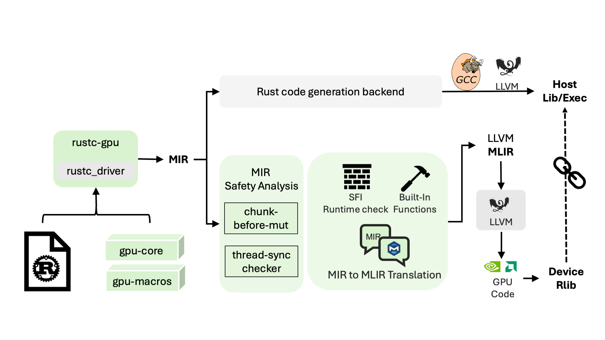

# Safe GPU Programming via Rust (SeGuRu)

This is the source code repository for Safe GPU programming in Rust, a toolchain which aims to provide a easy-to-use and safe GPU language in Rust.

## Security Overview

SeGuRu extends the Rust ecosystem with compiler and runtime support for safe GPU programming. It leverages Rust’s strong type and memory safety guarantees to support:

1. Compile-time safety – A safe CPU–GPU interface in native Rust, where kernel parameters are fully type-checked and compile-time (const/static) execution configurations are guaranteed to be valid.

2. Lightweight runtime safety – Optimized, low-overhead bounds checking to ensure memory access safety without sacrificing performance.

3. Ease of debugging – Built-in debug-mode assertions and automatic integer overflow checks to facilitate error detection during development.

## Design of the tool




## Build the tool (`rustc-gpu`)

1. Add dependencies (cuda, llvm)

```bash
source ./scripts/deps.sh
```

NOTE: Please use Cuda version 12.8, 12.9, or 13.0. Other cuda versions might also work but are not tested yet and may have API mismatch issue in cuda_binding crate.

NOTE: You need to do `apt install binutils` if you encountered the missing
`libzstd` error. If you see other errros, please try the similar steps in
`.github/workflows/rust.yml`.

2. Build the tool

```bash
cd crates
cargo build
```

Refer to [install](doc/install.md) for more information about how to build the tool.

## Examples

Add `gpu_macro` and `gpu` crates in Cargo.toml.

`gpu` crate is the GPU core crate for GPU programming.
`gpu-host` crate is a host-side crate to launch gpu kernels.

```TOML
[dependencies]
gpu = {...}
gpu_host = {...}
```

Define GPU and Host functions.

```rust
use gpu::SafeGpuConfig;

#[gpu::cuda_kernel]
pub fn kernel(input: &[f32; Config::BDIM_X as _]) {
    gpu::println!(
        "Hello world... input = {}",
        input[gpu::thread_id::<gpu::DimX>() as usize]
    );
}

fn main() {
    gpu_host::cuda_ctx(0, |ctx, m| {
        let input = ctx
            .new_tensor_view(&[1.01; 1])
            .expect("Failed to allocate input");
        let config = gpu_host::gpu_config!(1, 1, 1, 1, 1, 1, 0);
        kernel::launch(config, ctx, m, &input).expect("Failed to run host arithmetic");
    });
}
```

Here, `cuda_kernel` macro generates a host wrapper function that takes extra
parameters for execution (config: impl GpuConfig, ctx: GpuCtxGuard, m:
GpuModule). The config can use a mixed static and dynamic parameters. When using
static/const parameters, the monomorphic kernel function will take advantage of
the const parameters to optimize code.

Refer to [examples](examples/) to get more example codes.

```
cd examples
cargo run --bin ...
```

## Tests
